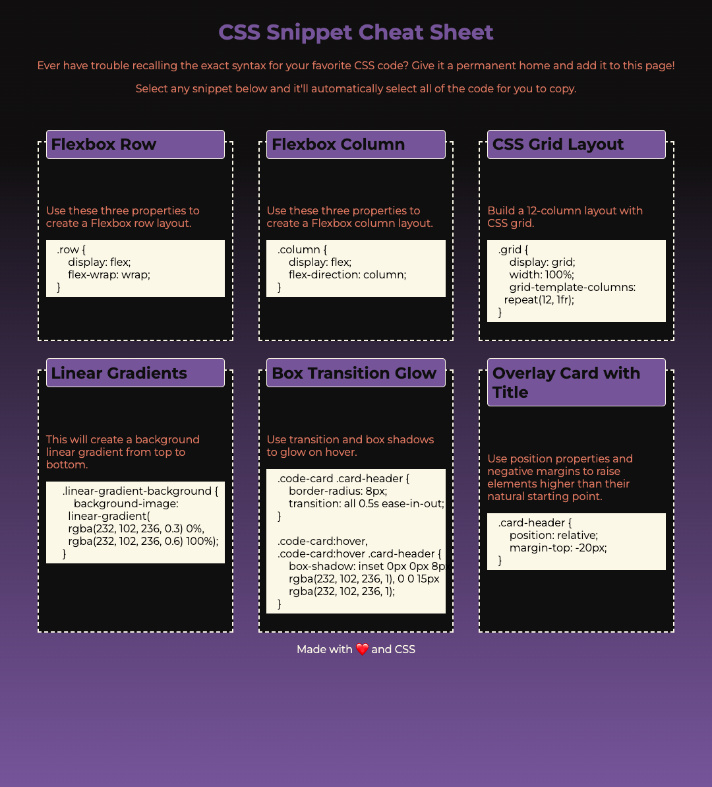

# css-snippet-cheatsheet

## About

```
This is a CSS styling resource that includes snippets of copyable code for common CSS functions. Users can click on any code snippet to automatically select the text for easier copying. The website displays responsively on a variety of viewport sizes.
```

## Screen Shot




## Deployed Link

```
https://relero90.github.io/css-snippet-cheatsheet/
```
